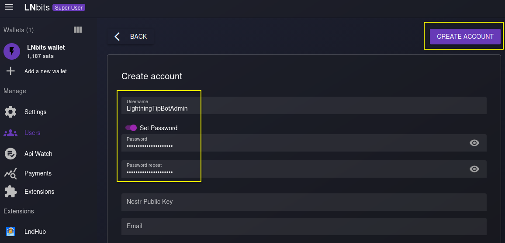
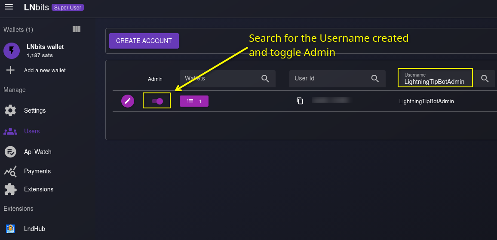

<p align="center">
  	
</p>

# @LightningTipBot 🏅

[](https://github.com/ChuckNorrison/LightningTipBot/actions/workflows/go.yml)

A Telegram Lightning ⚡️ Bitcoin wallet and tip bot for group chats.

This repository contains everything you need to set up and run your own tip bot. If you simply want to use this bot in your group chat without having to install anything just start a conversation with [@BTCMaxisLightning_bot](https://t.me/BTCMaxisLightning_bot) and invite it into your group chat.

## Setting up the bot

### Installation

To build the bot from source, clone the repository and compile the source code.

```
git clone https://github.com/ChuckNorrison/LightningTipBot.git
cd LightningTipBot
go build .
cp config.yaml-example config.yaml
```

After the configuration (see below), start it using the command

```
./LightningTipBot
```

### Configuration

You need to create the `config.yaml` before you can start the bot.

Start with copy the `config.yaml.example` as `config.yaml`

#### Set up LNbits first

- After UserManager extension was integrated in LNBits, there is no need for any extensions to run the LightningTipBot anymore
- You need to have access to an `admin user` of your LNBits instance.
- To create an admin user for your LightningTipBot, login as your super user and check Users on the left. More informations regarding super user login can be found [here](https://docs.lnbits.org/guide/admin_ui.html).
- Here we can click on `Create Account` and create a new user. You can freely choose username and a secure password.

<p align="center">
	
</p>

- Next we can filter the username in the list of users and toggle admin for this new user

<p align="center">
	
</p>

- Edit your config.yaml and set `admin_username` and `admin_password` with your new admin user credentials

#### Create a Telegram bot

Create a new Telegram bot by starting a conversation with the [@BotFather](https://core.telegram.org/bots#6-botfather). After you have created your bot, you will get an **Api Token** which you need to add to `telegram_api_key` in config.yaml accordingly.

#### More configurations

- `db_path`: User database file path.
- `transactions_path`: Transaction database file path.
- `buntdb_path`: Object storage database file path.
- `lnbits_webhook_server`: URL that lnbits can reach the bot with. This is used for creating webhooks from LNbits to receive notifications about payments (optional).
- `message_dispose_duration`: Duration in seconds after which `/tip` are deleted from a channel (only if the bot is channel admin).
- `http_proxy` uses a proxy for all LNURL-related outbound requests (optional).
- `lnurl_public_host_name` is the public URL of your lnbits/LndHub (for BlueWallet/Zeus support, optional).
- `lnurl_server` is the public URL for inbound LNURL payments and your lightning address host (optional).

## Features

#### Commands

```
/tip 🏅 Reply to a message to tip it: /tip <amount> [<memo>]
/balance 👑 Check your balance: /balance
/send 💸 Send funds to a user: /send <amount> <@user> or <user@domain.com> [<memo>]
/invoice ⚡️ Receive over Lightning: /invoice <amount> [<memo>]
/pay ⚡️ Pay over Lightning: /pay <invoice>
/help 📖 Read this help.
/advanced 🤖 Read the advanced help.
/basics 📚 More info.
/donate ❤️ Donate to the project: /donate <amount>
```

#### Advanced commands

```
/link 🔗 Link your wallet to BlueWallet or Zeus
/lnurl ⚡️ Lnurl receive or pay: /lnurl or /lnurl <lnurl>
```

### Inline commands
```
send 💸 Send sats to chat: @LightningTipBot send <amount> [<memo>]
```

📖 You can use inline commands in every chat, even in private conversations. Wait a second after entering an inline command and click the result, don't press enter.

### Inline send

You can use inline commands to send payments to anyone who can read your messages, even inside private chats and group chat in which the bot isn't part of. For that, you need to trigger an [inline command](https://core.telegram.org/bots/inline). Here is how it works: Enter the name of the bot (`@LightningTipBot`) and the command you want to trigger (`send 13 Hi friend!`). When the result pops up above the text field, click it to send it to the chat. Do not press enter. 

<p align="center">
	
</p>

### Live tooltips

The bot replies to a tipped message to indicate to all participants how many and what amount of tips a post has received. This tooltip will be updated as new tips are given to a post.

<p align="center">
	
</p>


### LNURL server

Users can send and receive via . For this to work, you need to set the `lnurl_public_server` in `config.yaml`. The bot will then host a LNURL endpoint at `.well-known/lnurlp/username` which handles the data exchange with other wallets. You can set `http_proxy` in `config.yaml` to send outbound requests only via an HTTP proxy.

### Send and receive via Lightning Address

Every user has a [Lightning Address](https://lightningaddress.com/) a la `username@host.com` with which they can send to via `/send <amount> <user@domain.com>` and receive from other wallets.

### Link to BlueWallet or Zeus

Every user can link their wallet to an external app like [Bluewallet](https://bluewallet.io/) or [Zeus](https://zeusln.app/) by using the command `/link`. If you host the bot, you will have to enable the LndHub extension in LNbits. You also need to edit the `lnbits_public_url` entry in `config.yaml` accordingly to an address that can be reached by the user's wallet (Tor should be fine as well).

<p align="center">
  	
</p>

### Pay invoices by sending QR codes

To pay a Lightning invoice, you can snap a photo of a QR code and send it directly to the bot. Note that you might need to zoom in, center the QR code, or crop the image if the bot fails to decode the QR code from the photo. By the way, you can also just send an the invoice as a string, the bot will automatically detect it and initiate a payment.

<p align="center">
  	
</p>

### Auto-delete commands

To minimize the clutter all the heavy tipping can cause in a group chat, the bot will remove all failed commands (for example due to a syntax error) from the chat immediately. All successful commands will stay visible for `message_dispose_duration` seconds (default 10s) and then be removed. The tips will sill be visible for everyone in the Live tooltip. This feature only works, if the bot is made admin of the group.

## Made with

- [LNbits](https://github.com/lnbits/lnbits) – Free and open-source lightning-network wallet/accounts system.
- [telebot](https://github.com/tucnak/telebot) – A Telegram bot framework in Go.
- [gozxing](https://github.com/makiuchi-d/gozxing) – barcode image processing library in Go.
- [ln-decodepay](https://github.com/fiatjaf/ln-decodepay) – Lightning Network BOLT11 invoice decoder.
- [go-lnurl](https://github.com/fiatjaf/go-lnurl) - Helpers for building lnurl support into services.
